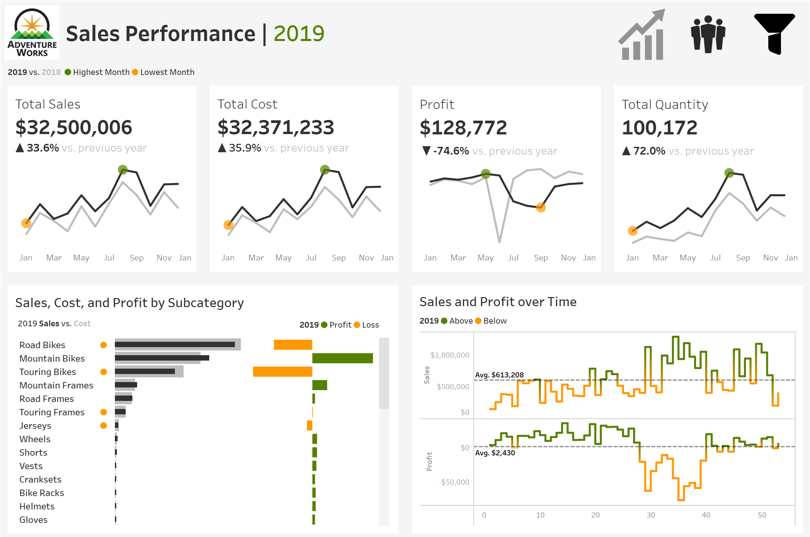
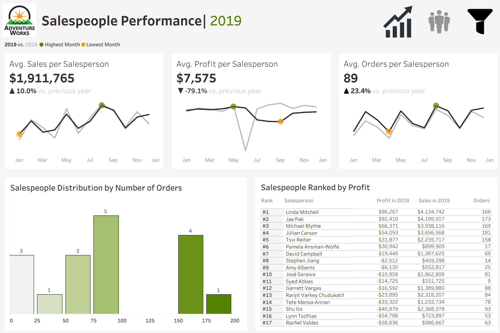

# Sales Performance Analysis
This project analyzes sales data from the AdventureWorks database, a sample dataset provided by Microsoft for SQL Server users. Adventure Works is a fictional bicycle and accessories company, and the dataset contains information on sales, products, regions, and salespeople. The subset used here covers sales data from 2017–2019.

Dataset source: [AdvetureWorks Sample Dataset](https://learn.microsoft.com/en-us/sql/samples/adventureworks-install-configure?view=sql-server-ver17&tabs=ssms)

## 1. Project Requirements

The goal of this project was to build 2 interactive Tableau dashboards to support stakeholders, including sales managers and executives, in analyzing sales and salespeople performance.

**Key requirements:**
- Enable year-by-year comparisons with flexible year selection.
- Allow users to filter by product category, subcategory, and region.
- Make charts interactive.
- Provide easy navigation between the 2 dashboards.

## 2. Dashboards

The project consists of two dashboards, each designed to address different aspects of the company’s performance.

**Sales Dashboard**

- presents a comprehensive view of sales performance by tracking total sales, cost, profit, and quantity, with comparisons between the current and previous year displayed month by month;
- highlights product subcategory performance by contrasting sales with cost to identify areas of profit and loss, giving managers insight into which products drive growth;
- shows weekly sales and profit trends with averages that allows to spot periods of strong or weak performance throughout the year.

**Salespeople Dashboard**

- focuses on individual performance, showing average sales, profit, and orders per salesperson, the distribution of order volumes across the team, and a ranked view of the top ten salespeople by profit with supporting detail;
- helps management quickly assess performance, recognize standout employees, and identify areas for improvement across the sales team.

## 3. Data Preparation

To prepare the dataset for analysis, CSV files were imported into Tableau and modeled by establishing relationships between fact and dimension tables, including *Sales_fact*, *Product_dim*, *Region_dim*, and *Salesperson_dim*. The data was cleaned by renaming tables, adjusting data types, and assigning geographic roles to location data.

## 4. Building Charts and Dashboards

**Charts**

**KPI**: Created big number charts (BANs) with year-over-year growth indicators and sparklines to illustrate monthly trends for total or average sales, profit, cost, quantity, number of orders.

**Product analysis**: Used bar-in-bar charts to compare sales and cost across product subcategories, highlighting profit or loss for each subcategory.

**Time trends**: Designed line charts to display weekly sales and profit with average reference lines, making it easy to identify periods of above/below-average performance.

**Salespeople distribution**: Built a histogram to show how salespeople are distributed by number of orders, providing insights into typical performance levels and identifying underperformers and top achievers.

**Top performers**: Developed a ranking table listing the top ten salespeople by profit, including additional details such as total sales, number of orders, and rank.

**Calculated Fields**

Implemented dynamic calculations for current and previous year values using a parameter, as well as formulas for growth rates, averages, and min/max values to support sparklines and trend analysis.

**Design**

Removed unnecessary gridlines, formatted or hid axes and headers, applied a consistent font and custom color palette, and added interactive tooltips for improved user experience.

**Dashboard Integration**

Combined the charts into two dashboards with filters and navigation icons, enabling smooth transitions and interactive analysis across different views.

## 5. Tools Used

- **Tableau Public:** for data visualization and dashboards
- **MS Excel:** for dataset preparation

## 6. Dashboard Previews

## 7. Inspiration

This project was inspired by [Baraa Khatib Salkini](linkedin.com/in/baraa-khatib-salkini-845b1b55) and his [Tableau Ultimate Full Course Tutorial on YouTube](https://youtu.be/K3pXnbniUcM?si=qtDyBE5MnNACMDpB).
